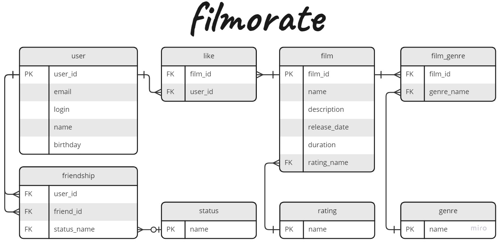

# java-filmorate
Пояснения по схеме:
- Касательно связей "один ко многим" требуются уточнения
- Касательно таблиц friendship, like, film_genre, допускаю, что это связующий таблицы и в них PK не обязателен
- Касательно таблиц status, rating, genre, их реализация в коде через 'enum', которые уникальны

А тут примеры запросов:
- Только непонятно каких, HTTP или в базе данных