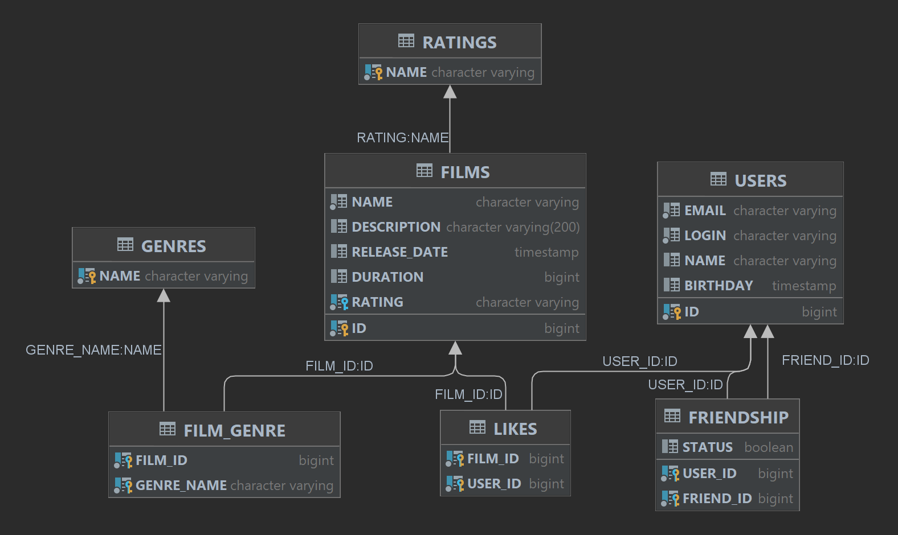

# java-filmorate
Пояснения по схеме:
- Схема создана с помощью IDEA

Примеры запросов:
- Показать все фильмы:
  - SELECT *
    FROM films;
- Показать всех пользователей:
  - SELECT *
    FROM users;
- Найти фильм по id:
  - SELECT *
    FROM films
    WHERE id = ?;
- Найти пользователя по id:
    - SELECT *
      FROM users
      WHERE id = ?;